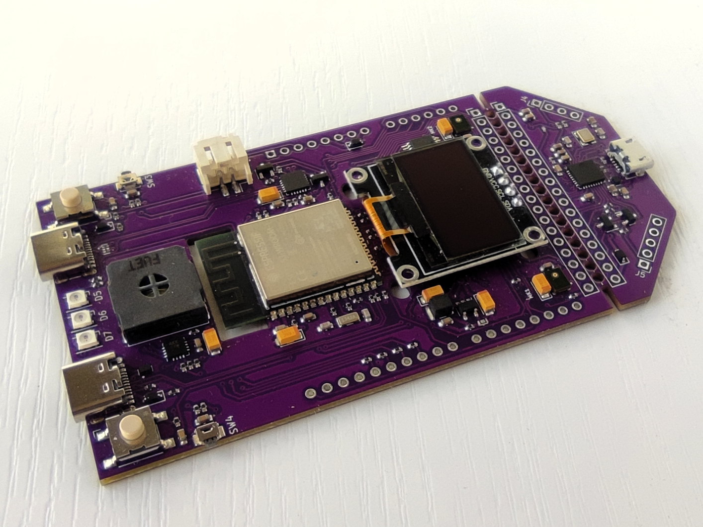
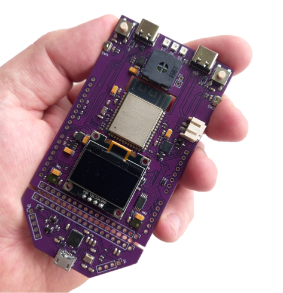
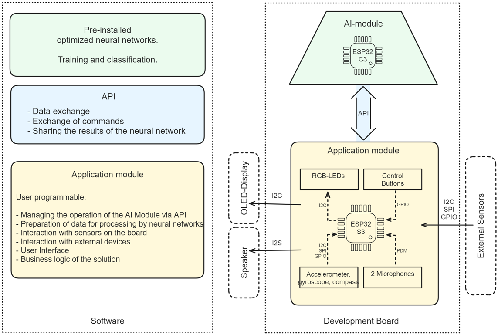
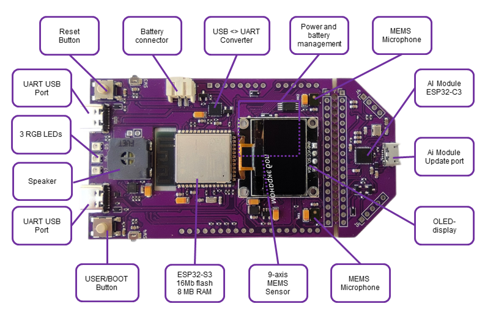

# Development Kit and Reference Design for Industrial AIoT Applications GRC Dev Board
**Quick start to developing ML-applications**

## Description

### The GRC Dev Board allows

* Promptly testing ready-made, pre-configured neural networks running on a “co-processor” (AI-Module);
* Checking viability of ML algorithms in solving your tasks and selecting AI functionality which will suit best your goals;
* Developing software, debugging and testing for a target device.

### Where Can It Be Used? ​
* Student training
* Predictive maintenance
* Equipment condition monitoring
* Smart Home Systems
* Command word recognition
* Gesture recognition

### Recommended sensors
* Vibrations sensors
* Microphones
* Current sensors
* Accelerometers
* Temperature sensors
* Other sensors which control time series data flow

## Perks of using GRC Dev Board:
* Saving time and resources at the development stage, as there is no need in
	* Development of mathematical and statistical anomaly models;
	* Signal mapping and dataset preparation;
	* Training model in the cloud.
* Reducing expenses for the end solution, as there is no need to spend money on
	* Data transfer from a target device;
	* Storing large amounts of data;
	* Infrastructure for processing large data amounts.
* Development of autonomous solutions due to low power consumption and no need in data transfer to a server.
* Privacy and security are guaranteed as there is no need in transferring sensor signal from the target device to a server
* Vast potential of developing flexible solutions configurable to particular hardware.
* Ultra-low latency: Real-time applications

## Functional Scheme
  
The GRC Dev Board features AI and Application modules to bring functionality for simple sensors connection, on-the-fly software development and debugging.

### AI module

The work of the neural network created for the AI tasks is run on the MCU using input data gathered from sensors. The solution provides:​

**“Training” mode:​**
* With an operator;​
* No dataset and data mapping are required;
* Up to 5 categories;​
* Performance speed less than **2 seconds**.
​
**“Classification” mode:​**
* Classification of one of 5 pre-trained categories;
* Аnomaly detection;​
* Performance speed less than **2 seconds**.​

### Application Module

ESP32-S3 with user-programmable software.

Provides voice user interface based on neural network featuring
* recognition of voice user commands;
* voice notifications about status, working modes, ongoing operations;
* confirmation of user commands.

Prepares data for the AI module and displays the results. Provides interacting with peripheral equipment and an AI module.
* Sensors management and control;
* Data pre-processing;
* Data flow transfer onto the GRC AI Module;
* GRC AI Module management and control;
* Data post-processing;
* Results shown on OLED display, via LEDs, speaker, text to UART USB port;
* Voice control (command words).

## Components

* Processors:
  * Main processor: Tensilica Xtensa 32-bit LX7 microprocessor
    * Cores: 2
    * Clock frequency: up to 240 MHz
    * Performance: up to 600 DMIPS
* Easily-detachable GRC AI SW module, a tailored solution for AIoT tasks
* Memory
  * 384 KB ROM
  * 512 KB SRAM
  * 16 KB SRAM in RTC
  * 16 MB of PSRAM
  * 16 MB of SPI Flash
* Connectivity: USB, UART to USB interface CP2102N
* Rich choice of sensors:
  * 2 ultra-compact, low-power, omnidirectional, digital MEMS microphone MP34DT06JTR (PDM microphones)
  * A multi-chip module MPU-9250 (9-axis sensor: a gyroscope, an accelerometer, and a compass)
* Modular architecture, expandable via on-board connectors:
  * ESP32 USB port
  * UART USB port
  * Battery connector
  * OLED Display port
  * Arduino compatible extension port
* Support of battery power supply with charge control and protection
* Other Dev Board components:
  * 3 RGB LEDs – SK6805
  * 4 buttons
  * Power and battery management
  * OLED Display (optional)

## Demo scenarios:​

### Detection of Fan Operating Modes and Anomalies in Its Work
The Dev Board is placed on a fan’s case; it processes the data stream from the accelerometer in real time to store and further classify fan operating modes or non-standard conditions (anomalies).

### Spatial Gesture Recognition​ 
For use on mechanisms, which moves along a given trajectory, e.g., an industrial manipulator on a conveyer, a robotic arm. It is placed on a manipulator’s case, learns the “gestures” and then recognizes their types and notifies about deviations. 

### Voice PIN Code​ 
The Dev Board remembers and recognizes a 4-digit code pronounced by a user.  

### Rhythm As a Digital Key 
A user saves a certain rhythm (by tapping on a Dev Board’s surface), which is further used as a personal key.​ 

## Delivery Documents

* [Dev Board User Guide](https://github.com/Grovety/grc_devboard/blob/main/docs/GRC_DevBoard_User_Guide.md);
* [Dev Board Developer’s Guide (including code examples)](https://github.com/Grovety/grc_devboard/blob/main/docs/GRC_DevBoard_Development_Guide.md);
* [GRC Developer's Guide (including recommendations on embedding AI Module into other devices)](https://github.com/Grovety/grc_sdk/blob/main/docs/GRC_AI_module_SDK_Developer_Guide.md)
* [AI-module Description](https://github.com/Grovety/grc_sdk/blob/main/docs/GRC_AI-module.md)

## CONTACT US

<hi@grovety.com>

<https://grovety.com>
