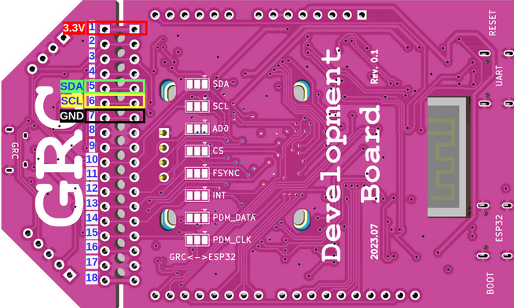

# GRC Development Board Guide

## Description

GRC Dev Board has:

* 2 ultra-compact, low-power, omnidirectional, digital MEMS microphones
* A multi-chip module MPU-9250 (9-axis sensor: a gyroscope, an accelerometer, and a compass)
* 3 RGB LEDs
* 4 buttons: Reset, Back/Sleep and two User/Boot buttons
* OLED Display (optional)

## Power

* Development Board
  * via USB-port
  * from battery
* GRC
  * from Dev Board
  * With another device:
    * via power pins (see Figure 2)
    * via USB-port

## Connection

### Development Board

The Dev Board is delivered with all connections made and ready for work.

|   | **SDA** | **SCL** |
| -- | ------- | ------- |
| GRC | GPIO_0 | GPIO_1 |
| DevBoard |  GPIO_12 | GPIO_13 |

### Other devices

For attaching your own device to GRC, connect SDA, SCL, GND pins correspondingly to GRC.

When connecting SDA and SCL line, it is required to provide outline to power via 4.7 kΩ resistor.

## Demo

GRC_AI_SW_DEMO (Dev Board is delivered with demo firmware pre-installed) aims to showcase work with device peripherals:

* GRC
* Display
* Buttons
* Device memory
* Built-in accelerometer
* LEDs
* Microphone
* Speaker

The demo offers four scenarios, in which data are received from an accelerometer or microphones, pre-processed, and sent for training/classification at the GRC AI Module over I2C.

**VibroProject** – allows recognizing different types of vibrations, for example, different fan work modes. The data received from an accelerometer are unfolded, normalized, and filtered. During the recognition process, the device shall be in the same position as it was during training, otherwise, correct results are not guaranteed.

**RhythmProject** – recognize different tap rhythms. The data outliers are identified and the distances between them are calculated.

**VoicePINProject** - learning and recognizing 4-digit PIN code said by user. Recognition of sequences of spoken digits from 0 to 9. A simple voice activity detector used to detect words in a microphone data stream, the detected segments are then pre-processed and fed into the KWS model.

**GestureProject** – allows training in several hand gestures (i.e. types of Dev Board movement) for their further recognition and classification. For example, moving the Dev Board Left-Right or in a circle. Currently, the solution incorporates smoothing and dimensionality reduction (average out of 10 measurements) of data received from the accelerometer. It helps to remove slight deviations (e.g., trembling hands).

## Demo Project Structure

* **App** – description of demo scenarios with user interface: menus, navigation, actions with buttons for each of the above test scenarios:
  * **IButton.hpp, IDisplay.hpp, ILed.hpp. ISensor.hpp, IStorage.hpp** – provides interfaces for working with peripherals;
  * **State.hpp/State.cpp** – provides the app state interface;
  * **App.hpp/App.cpp** – provides a description of the app structure and common app states;
  * **Event.hpp/Event.cpp** – events processing;
  * **KWS.hpp/KWS.cpp** – process events from KWS model;
  * **Status.hpp/Status.cpp** – provides work with app status indication;
  * **GrcHelper.hpp/GrcHelper.cpp** – provides helper functions for working with Grc;
  * **Listener.hpp/Listener.cpp** – sensor data collector task interface;
  * **GestureScenario.cpp** – gesture recognition scenario implementation;
  * **RhythmScenario.cpp** – rhythm pattern recognition scenario implementation;
  * **VibroScenario.cpp** – vibration recognition scenario implementation;
  * **VoicePINcodeScenario.cpp** – voice PIN code recognition scenario implementation.
* **Common** – common utilities:
  * **Common.hpp/Common.cpp** – common utilities;
  * **Log.hpp/Log.cpp** – logging functions;
  * **Types.hpp** – common types;
  * **Matrix.hpp, Matrix_impl.hpp** – custom matrix implementation for storing signal data;
  * **Matrix_svd.hpp, Numbers.hpp, Statistics.hpp** – statistical utilities;
* **Grc** – Interfaces for interacting with GRC:
  * **BaseGrc.hpp/BaseGrc.cpp** – GRC interaction interface using GRC_SDK;
  * **GestureGrc.hpp/GestureGrc.cpp, VibroGrc.hpp/VibroGrc.cpp, RhythmGrc.hpp/RhythmGrc.cpp** – implementation of GRC interaction interfaces: receiving, sending and pre-processing data, model initialization, training and inference for each of the scenarios described above;
  * **reservoirs/** – encrypted reservoir data for GRC initialization.
* **Hardware** – implementation of device peripherals:
  * **Accelerometer.hpp/Accelerometer.cpp** – accelerometer driver;
  * **Button.hpp/Button.cpp** – work with built-in buttons;
  * **I2C.h/I2C.cpp** – work with the I2C interface;
  * **Lcd.h/Lcd.cpp** – work with OLED-display;
  * **Led.h/Led.cpp** – LEDs control;
  * **NVStrorage.hpp/NVStrorage.cpp** – interface for interaction with non-volatile memory.
* **KWS** – KWS (keyword spotting) component:
  * **mfcc/** – implementation of MFCC preprocessing;
  * **kws.h/kws.cpp** – interface for working with TFLiteMicro interpreter;
  * **kws_preprocessor.h/kws_preprocessor.cpp** – preprocessing of detected words;
  * **model.cpp** – KWS model in binary format.
* **MicReader** – i2s microphone component:
  * **def.h** – i2s rx driver and VAD parameters;
  * **i2s_rx_slot.h/i2s_rx_slot.cpp** – i2s rx driver;
  * **mic_reader.h/mic_reader.cpp** – simple VAD/segmentator implementation;
  * **mic_proc.h** – microphone data processing.
* **VoiceMsgPlayer** – i2s wav player component:
  * **I2sTx.hpp/I2sTx.cpp** – i2s tx driver;
  * **WavPlayer.hpp/WavPlayer.cpp** – wav player;
  * **VoiceMsgPlayer.hpp/VoiceMsgPlayer.cpp** – wav player control;
  * **Types.hpp** – common types;
  * **Samples.hpp** – table of wav samples in binary format.
