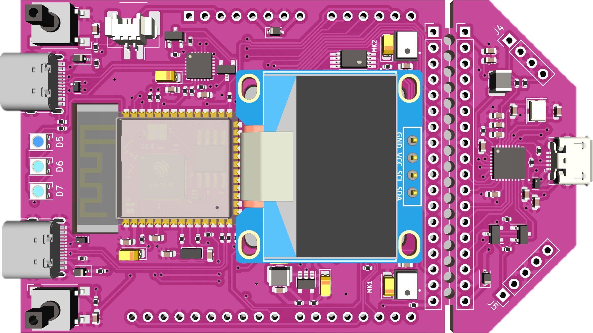
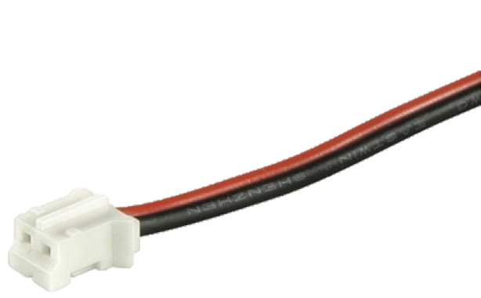
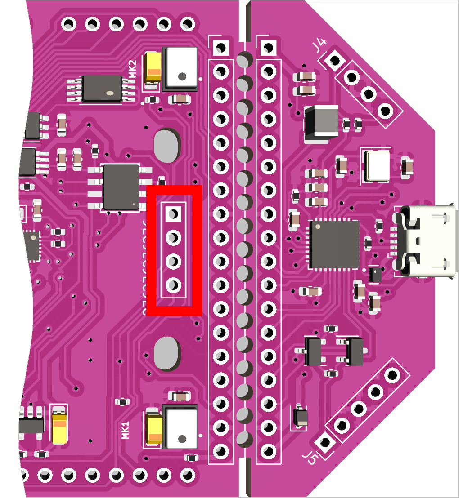
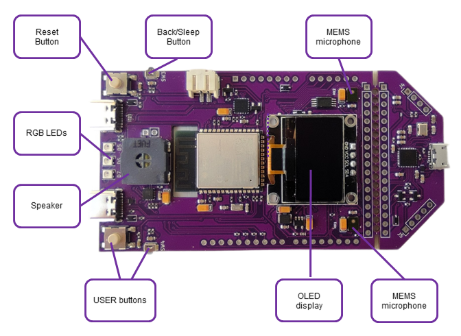
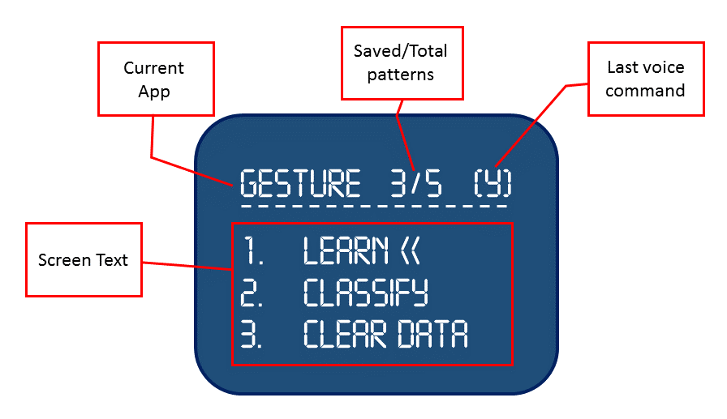
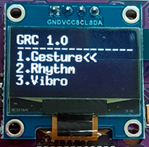
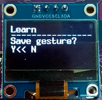

# GRC DevBoard User Guide

## In the Box

### GRC Development Board

### 2 PIN Battery connector with cables

### USB-C Cable 2m

## Connection

### Power

* Power Bank

* Battery

  

### OLED Display

 

A display is added by soldering two power and two I2C pins.

*Note: An OLED display is an optional component.*

*Use UART-terminal to get messages in console on PC.*

### Interaction

#### Buttons

| Actions | Command  |
|---------|----------|
| DevBoard reset | **RESET** Press and hold > 2 sec |
| Menu navigation | any **USER** Press |
| Start operation | any **USER** Press |
| Select menu items | any **USER** Press and hold >2 sec |
| Go back| **BACK/SLEEP** Press |
| Sleeping Mode | **BACK/SLEEP** Press and hold >2 sec 

#### Screen menu

*
IDF Monitor
*

To get screen messages without a display, connect the DevBoard to your PC, run IDF Monitor and open the port. The board screen messages will be transmitted to the console. IDF Monitor for ESP32 User guide - https://docs.espressif.com/projects/esp-idf/en/latest/esp32/api-guides/tools/idf-monitor.html

#### Voice commands

| Action | Command |
|--------|---------|
| Confirm | **YES** |
| Cancel  | **NO** |
| Open menu item | **1-4** |
| Go up | **Up** |
| Wake Up | **Sheila** |

#### LEDs

| Color | Meaning |
|-------|---------|
| **BLUE** | Ready |
| **YELLOW** | OK |
| **WHITE** | Running |
| **RED**  | Fail  |
| **GREEN** | Success  |
| **LIGHT BLUE** | Sleeping |

### Clear dataset

In VoicePIN, dataset is cleared after every reset. In other apps, do the following:

1. Select “Clear dataset”.
2. Confirm the operation.

### Sleeping Mode 

The DevBoard will automatically switch to the sleeping mode if inactivity period is more than 1 minute. Otherwise, press and hold **BACK/SLEEP**. 

To wake-up the board, say **SHEILA** or press **USER**. 

## Quick Start

### Step 1. Acquaintance

Master the control of the device, become familiar with buttons, LEDs, commands and sequence of actions.
Go for simple.
Practice actions which are easy to repeat, Up-Down, Left-Right.

### Step 2. Let's go

Once you get familiar with the board operating routine, you can go for more complicated patterns.

***Tip***: *to guarantee proper and successful recognition of gestures and rhythm patterns, reproduce them as accurately as possible.*

### Vibro App

Vibro app performs anomaly detection and classification of an electric motor operating.

***Tip:*** *The scenario below demonstrates work of the app when using a fan*

#### Learning
1. Put the DevBoard on the fan.

*Tip: To achieve better results, attach the DevBoard firmly to the device.*

2. Run the anomaly detection.

3. Save the silent mode (i.e. device is not operating) as one of the patterns.

4. Switch on the fan, and run the first speed mode.

*Tip: To achieve better results, wait till the fan completely switches to the mode and operates smoothly.*

5. Save the anomaly as one of the patterns.

Repeat steps 4-5 for the second and third-speed modes.

#### Classification
1. When all the required patterns are saved, run the anomaly detection.

2. Switch the speed modes to test the work of the app.

### VoicePIN

#### Learning 

1. Say 4-digits code. 

2. Confirm the combination. 

#### Classification 

1. Say 4-digits code. 

2. Get result. 

### Rhythm App

The rhythm app learns a sequence of tapping sounds and recognizes the saved patterns.

***Tip***: *to achieve better results, we recommend that you either tap a rhythm on the DevBoard’s surface or make sure the DevBoard is set firmly and will not move in the process (e.g. use double-sided tape or rubber fit)*

#### Learning

1. Run learning.
2. Tap a rhythm (within 3 seconds)
3. Save the pattern.

#### Classification

1. Run classification.
2. Tap a rhythm.
3. Get results.

### Gesture App

The gesture app learns gestures and recognizes the saved patterns.

#### Learning

1. Press and hold <**USER**>.
2. Make a gesture (within 3 seconds).
3. Release the button.
4. Save the pattern.

#### Classification

1. Run classification.
2. Make a gesture.
3. Get results.
