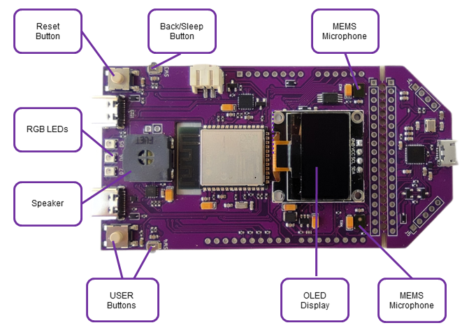
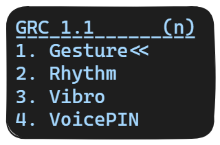
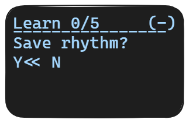

# GRC Dev Board User Guide

## In the Box

### GRC Development Board

### 2 PIN Battery connector with cables

### USB-C Cable 2m

## Connection

### Power

* Power Bank

* Battery

  

### OLED Display

 

A display is added by soldering two power and two I2C pins.

*Note: An OLED display is an optional component.*

*Use UART-terminal to get messages in console on PC.*

### Interaction

#### Buttons

| Actions | Command  |
|---------|----------|
| Dev Board reset | **RESET** Press and hold > 2 sec |
| Menu navigation | **USER** Press |
| Start operation | **USER** Press |
| Select menu items | **USER** Press and hold >2 sec |

#### Screen menu

*
IDF Monitor
*

To get screen messages without a display, connect the Dev Board to your PC, run IDF Monitor and open the port. The board screen messages will be transmitted to the console. IDF Monitor for ESP32 User guide - https://docs.espressif.com/projects/esp-idf/en/latest/esp32/api-guides/tools/idf-monitor.html

#### Voice commands

| Action | Command |
|--------|---------|
| Start learning or classification | **GO** |
| Confirm | **YES** |
| Cancel  | **NO** |
| Open menu item | **1-3** |
| Go up | **Up** |
| Wake Up | **Sheila** |

#### LEDs

| Color | Meaning |
|-------|---------|
| **BLUE** | Ready |
| **YELLOW** | OK |
| **WHITE** | Running |
| **RED**  | Fail  |
| **GREEN** | Success  |
| **LIGHT BLUE** | Sleeping |

### Clear dataset

1. Select “Clear dataset”.
2. Confirm the operation.

## Quick Start

### Step 1. Acquaintance

Master the control of the device, become familiar with buttons, LEDs, commands and sequence of actions.
Go for simple.
Practice actions which are easy to repeat, Up-Down, Left-Right.

### Step 2. Let's go

Once you get familiar with the board operating routine, you can go for more complicated patterns.

***Tip***: *to guarantee proper and successful recognition of gestures and rhythm patterns, reproduce them as accurately as possible.*

### Gesture App

The gesture app learns gestures and recognizes the saved patterns.

#### Learning

1. Press and hold <**USER**>.
2. Make a gesture (within 3 seconds).
3. Release the button.
4. Save the pattern.

#### Classification

1. Run classification.
2. Make a gesture.
3. Get results.

### Rhythm App

The rhythm app learns a sequence of tapping sounds and recognizes the saved patterns.

***Tip***: *we recommend that you tap a rhythm on the Dev board’s surface to achieve better results.*

#### Learning

1. Run learning.
2. Tap a rhythm (within 3 seconds)
3. Save the pattern.

#### Classification

1. Run classification.
2. Tap a rhythm.
3. Get results.

### Vibro App

Vibro app performs anomaly detection and classification of electric motor operating.

***Tip:*** *Use a fan (air cooler).*

#### Classification

1. Put the Dev Board on the device.
2. Run the anomaly detection.
3. Save the anomaly as one of the patterns.
